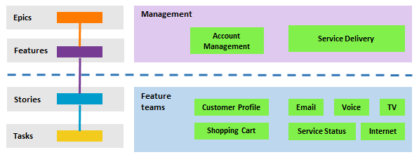

# Work Organisation

How work is structured, named, and organised in Azure DevOps. This skill defines the **philosophy** — the "why" and "what" of hierarchy design. For CLI commands and mechanics, see `azure-devops-boards`. For writing style, see `writing-style`.

## Work Item Hierarchy

Azure DevOps hierarchy (top to bottom):
- **Initiative** (custom portfolio level): The product or strategic programme. The top-level container.
- **Epic**: Business capability domain. Answers "what area of the product is this about?" Vertical swimlane in the capability matrix.
- **Feature**: Long-lived vertical slice capability within an Epic. Accumulates PBIs over time. Cross-iteration by nature.
- **PBI (Product Backlog Item)**: A specific deliverable. The unit of scheduled work, scoped to one iteration.
- **Task**: Implementation step within a PBI.

**Note**: Initiative is a custom portfolio backlog level. Query the project's process to find configured backlog levels.

**Reference**: [Define features and epics](https://learn.microsoft.com/en-us/azure/devops/boards/backlogs/define-features-epics?view=azure-devops&tabs=agile-process) | [Organize your backlog](https://learn.microsoft.com/en-us/azure/devops/boards/backlogs/organize-backlog?view=azure-devops)

## Hierarchy Design Principles

### Name by capability, not motivation

Work item hierarchy should be based on **capability areas** — not the reason for doing the work. Motivations change; capabilities don't.

**Bad**: An "Security" initiative with an "APIM Decommission" epic. If the motivation shifts from security to cost reduction or compliance, the hierarchy breaks — the work hasn't changed, but the label no longer fits.
**Good**: A "Platform" initiative with an "APIM Decommission" epic. The platform team owns this capability regardless of *why* it's being prioritised this quarter.

The hierarchy should be resistant to arbitrary business decisions about priorities and motivations. If the driving force changes but the work stays the same, the hierarchy should stay the same too.

### Epics represent domains, not task categories

An epic should answer "what area of the product is this about?" — not "what kind of work is this?"

**Good**: "Identity & Access" — clear domain that naturally accumulates related work (auth flows, user management, credential rotation)
**Good**: "Decommission legacy API gateway" — goal-based epic with clear scope and a definition of done
**Bad**: "Operations & Maintenance" — task category that becomes a dumping ground
**Bad**: "Backlog" — just means "stuff we haven't organised yet"
**Bad**: "Engineering tasks" — catch-all that avoids the question of where work belongs

The test: *would someone new to the project understand what work belongs here?*

### Epics are business capabilities, not systems or technologies

Name epics after the business capability, not the specific system that provides it. Systems change; business needs don't.

**Good**: "DMS Integration" — the business will always need a dealer management system for accounting, manufacturer reporting, and financial transactions. Whether it's ERA, TUNE, or eventually distributed microservices, the integration epic persists.
**Bad**: "ERA Integration" — couples the epic to today's vendor. When ERA is replaced, the epic name is wrong even though the work continues.

A DMS isn't just a database — it's records, business rules, manufacturer relationships, and financial operations (bank transactions, accounting entries). You can build better front-ends and streamline workflows, but the business backbone needs information flowing into it for the business to function. The epic represents that enduring need.

The same applies to other business systems: CRM, accounting, identity providers. Name the epic after *what the business needs*, not *which product provides it today*.

### Link operational work to the feature it supports

Credential rotation, secret management, and infrastructure changes belong under the feature that depends on them — not in a generic ops bucket. This makes the work discoverable in context. Someone looking at the user management feature should see that it has a Graph API dependency with credentials that need periodic rotation.

### Features are long-lived capabilities

Features persist across iterations and accumulate PBIs and bugs over time. A PBI is an iteration-scoped deliverable within a feature.

- **Feature**: "easyquote link management" — the capability, lives on indefinitely
  - **PBI**: "Rotate Graph API client secrets (2026-02)" — a specific deliverable, scoped to one iteration
  - **PBI**: "Add bulk link creation" — another deliverable in a future iteration

### Active vs Future hierarchy depth

**Active/committed work** must follow the full hierarchy: Initiative → Epic → Feature → PBI → Task. Every level should be present.

**Future/uncommitted work** (ideas, not yet planned) can skip levels: Initiative → PBI is fine. Structure comes when work is committed — don't pre-build Epic/Feature scaffolding for ideas that may never happen.

### Hierarchy = ownership, not taxonomy

The hierarchy answers **"who is responsible for this?"** — not "where does this sit?"

- **Epic**: Who owns this domain? Which person or team is accountable?
- **Feature**: An aggregation — a grouping of related PBIs under the same owner. Not designed top-down, but emerges from the PBIs.
- **Area path**: What system or component does the work touch?
- **Iteration**: When is it happening?

**The flow is bottom-up through ownership:**
1. You have a **PBI** — the real work
2. You ask **who is responsible?** — that gives you the **Epic**
3. The **Feature** emerges as the natural grouping of related PBIs under that Epic

Don't start top-down by decomposing Initiatives into Epics into Features. Start with the work (PBI), determine the owner (Epic), and let the Feature crystallise as the link between them.

This also means not every Epic needs to be a product capability. A startup (or any business) has real work that isn't building software:
- **Investment & Fundraising** — external/investor-facing
- **Internal Communications** — team engagement and reporting
- **Worker Compliance**, **Security** — operational domains

These are legitimate Epics representing business domains with clear ownership. The board reflects the whole business, not just the codebase. Think of it like assets and liabilities — both are necessary, both need tracking, they're just different sides of the coin.

## Three Independent Dimensions

Work items are organised along three independent axes:

- **Hierarchy** (parent-child): What capability does this belong to? Initiative → Epic → Feature → PBI → Task. This is the vertical structure — business capability domains (Epics) broken into long-lived capabilities (Features) broken into deliverables (PBIs) broken into implementation steps (Tasks).

- **Area Path** (horizontal swimlane): Which app or component owns this work? (e.g., Admin, Platform, Facilitators, Organisations). Area paths represent the system or application — where the code lives and who maintains it.

- **Iteration Path** (time-bound): When is this being worked on? Iterations are time-bound periods — they may represent different cadences (monthly support, numbered releases, quarterly planning) depending on the project's workflow. PBIs and Tasks are assigned to specific leaf iterations. Initiatives, Epics, and Features sit at the root iteration (cross-cutting).

These dimensions are **independent** and form a matrix. A Platform PBI can be in a Project iteration or a Support iteration. An Admin task and a Platform task can both be under the same Feature. A Feature under a "Subscriptions" Epic can have PBIs in the Platform area. Do not couple area paths to hierarchy or iteration type.

### Area paths vs Epics: horizontal vs vertical swimlanes

**Area paths** are *horizontal swimlanes* — the system or application (who owns the code):
- `WebApp` — the customer/dealer-facing web application
- `Platform` — backend services, API gateways, infrastructure, auth, configuration
- `DMS` — code running on dealer management system servers

**Epics** are *vertical swimlanes* — what the business needs (the capability or domain):
- "Deal Workflow" — the core process from deal creation to settlement
- "Finance & Insurance" — a department's vertical slice through the workflow
- "DMS Integration" — connecting to the business's operational backbone
- "Platform Reliability" — keeping systems running, SLAs, monitoring
- "Identity & Access" — authentication, authorisation, user management

**These are independent dimensions** forming a matrix. Area paths define team ownership and where code runs. Epics define business capability regardless of which team builds it. A "DMS Integration" feature might live under the `Platform` area (because the platform team owns the API layer) while serving work defined in the "Deal Workflow" epic. A "Finance & Insurance" PBI might live under `WebApp` (because it's a UI change) while its parent feature is under a finance epic.

### Area path and iteration assignment rules

**Initiatives, Epics, and Features**: Always at **root area path** and **root iteration**.

- These are capability domains and vertical slices — they don't belong to a single system or component.
- Even if all current PBIs under a Feature happen to be in one area, the Feature itself stays at root. Today's "all apples" may become "apples and oranges" tomorrow. Setting the area locks in an assumption that may not hold.
- Iterations are cross-cutting for the same reason — a Feature may accumulate PBIs across different iteration cadences.

**PBIs and Tasks**: Specific **leaf area path** (which app/component owns the code) and specific **leaf iteration** (when the work is scheduled).

- This is where the matrix comes alive: PBIs under the same Feature can have different area paths, and PBIs under the same Feature can be in different iterations.
- The PBI declares what it actually is — which system it touches and when it's being delivered.

### Planned vs Scheduled: two independent dimensions

Work items exist along two additional independent dimensions beyond hierarchy and area/iteration paths:

**Dimension 1 — Hierarchy Placement (Planned vs Unplanned)**:
- **Unplanned work**: Future ideas, not yet structured into the Epic/Feature hierarchy
- **Planned work**: Exists in the backlog hierarchy under an Epic or Feature, defining *what* needs to be built and *why*

**Dimension 2 — Iteration Assignment (Scheduled vs Unscheduled)**:
- **Unscheduled work**: Not assigned to a specific iteration, no delivery timeline commitment
- **Scheduled work**: Assigned to an iteration with dates, representing committed delivery

These dimensions are **independent** and create three practical states:

1. **Unplanned & Unscheduled**: Future ideas not yet in the backlog structure
2. **Planned & Unscheduled**: In the hierarchy (under Epic/Feature) but not assigned to iterations — scope is defined but timing is not committed
3. **Planned & Scheduled**: In the hierarchy AND assigned to iterations — committed work with delivery timeline

Any work item type (Epic, Feature, PBI, Task) can be scheduled or unscheduled depending on iteration assignment. Higher-level items (Epics, Features) are often planned but unscheduled, defining capability scope without iteration commitment. PBIs are typically both planned and scheduled when ready for delivery.

**For queries and backlog filtering**: Epics and Features appear on backlogs based on their area path and their children's iteration assignments. PBIs appear based on both area path AND iteration path — if a PBI isn't in one of the team's selected iterations, it won't show on their backlog even if the area path matches.

## Work Item Ownership by Team Level

Microsoft's recommended team structure explicitly separates portfolio management from delivery:

- **Management/Portfolio team**: Owns **Initiatives, Epics, and Features**
- **Feature/Delivery teams**: Own **PBIs/Stories and Tasks**



**Reference**: [Manage product and portfolio backlogs](https://learn.microsoft.com/en-us/azure/devops/boards/plans/portfolio-management?view=azure-devops)

### Backlog visibility rules

Each team should only enable the backlog levels relevant to their role:

- **Portfolio/Management team**: All levels enabled — Initiatives, Epics, Features, PBIs (for visibility across the whole project)
- **Feature teams**: Features + PBIs only — Initiatives and Epics disabled (focused on delivery scope)

This keeps backlogs focused and prevents feature teams from being overwhelmed by items they don't own. Management teams use the higher levels to track progress across feature teams.

### Hierarchical team pattern

**Portfolio/Management team**:
- All backlog levels enabled (for visibility across the whole project)
- All area paths with `includeChildren: true`
- Sees everything, manages at Initiative/Epic level, uses lower levels for visibility

**Feature teams (area-based)**:
- Features + PBIs only (Initiative/Epic disabled)
- Own area path only with `includeChildren: true`
- Focused on their delivery scope

**Feature teams (iteration-based)**:
- All area paths shared (same as portfolio team)
- Each team owns specific iterations (e.g., Project team owns FPR iterations, Support team owns Support iterations)
- This keeps area paths independent (area = which app/component, iteration = when/type of work)

**"Future" iteration** (optional):
- Parking place for ideas not yet scheduled
- Items sit at a `Future` iteration path until assigned to a specific sprint/cycle
- Keeps items out of active team backlogs while remaining visible to the portfolio team

**Reference**: [Configure hierarchical teams](https://learn.microsoft.com/en-us/azure/devops/boards/plans/configure-hierarchical-teams?view=azure-devops) | [Portfolio management](https://learn.microsoft.com/en-us/azure/devops/boards/plans/portfolio-management?view=azure-devops) | [Visibility across teams](https://learn.microsoft.com/en-us/azure/devops/boards/plans/visibility-across-teams?view=azure-devops) | [Agile culture](https://learn.microsoft.com/en-us/azure/devops/boards/plans/agile-culture?view=azure-devops)

## Description Conventions by Audience

### PBIs and Bugs (stakeholder-friendly)
- Describe the **what** and **why** — stakeholders may read these
- Use plain language, avoid implementation jargon
- See `writing-style` skill for tone and examples

### Tasks (implementation-oriented)
- Describe the **how** — these are for developers
- Can reference code, resolvers, handlers by name
- Include technical context that helps future-you understand the work

This is the one place where implementation detail is appropriate. PBIs say *what* needs to happen; Tasks say *how* to do it.

## Hierarchy Diagrams

**Visual guide**: See [references/hierarchy-design.png](references/hierarchy-design.png) for a diagram showing how Area Paths (horizontal swimlanes) and Epics (vertical swimlanes) form an independent matrix, with Features as vertical slices and PBIs at the intersections. Editable source: [references/hierarchy-design.drawio](references/hierarchy-design.drawio)

### Generating Hierarchy Diagrams

Three scripts generate draw.io diagrams from live Azure DevOps data:

1. **Extract** hierarchy data from Azure DevOps into JSON
2. **Generate hierarchy diagram** — area paths x epics matrix
3. **Generate timeline diagram** — area paths x iterations matrix

#### Step 1: Extract Hierarchy Data

```bash
cd ~/.claude/skills/work-organisation/output

# Extract → {project}-hierarchy.json
python3 ../references/extract-hierarchy.py --org <org-name> --project <Project>
```

**Options:**
- `--org`: Azure DevOps org name (e.g., `flightrac`) or full URL
- `--project`: Project name (e.g., `Flightrac`)
- `--initiatives`: Optional. Comma-separated initiative IDs or titles. If omitted, discovers all non-terminal (not Removed/Closed/Done) initiatives automatically
- `--output FILE`: Override output filename
- `--stdout`: Print to stdout instead of file

Requires `az` CLI with active login. Walks Initiative → Epic → Feature → PBI via work item relations. Features on the root area path are resolved from their PBI areas automatically. Also extracts iteration dates for use by the timeline generator.

#### Step 2: Generate Hierarchy Diagram

```bash
# Generate → {project}-hierarchy.drawio
python3 ../references/gen-hierarchy.py <project>-hierarchy.json
```

**Options:**
- First arg: Input JSON file (from extract step)
- `--output FILE`: Override output filename
- `--stdout`: Print to stdout instead of file

Creates a **single-page** diagram with Area Paths as horizontal swimlanes and Epics as vertical swimlanes. Features and PBIs are placed in the grid cells. Feature label heights are calculated dynamically based on title length.

**Connected-component grouping**: Initiatives that share area paths are placed side-by-side (horizontal). Independent initiative groups are stacked vertically as separate sections to reduce page width. Uses union-find to detect which initiatives overlap via shared areas. For example, if initiatives A and B both have PBIs in the "Platform" area, they form one section; initiative C with only "easyquote" PBIs forms its own section below.

#### Step 3: Generate Timeline Diagram

```bash
# Generate → {project}-hierarchy-timeline.drawio
python3 ../references/gen-timeline.py <project>-hierarchy.json
```

**Options:**
- First arg: Input JSON file (from extract step)
- `--output FILE`: Override output filename (default: `{input}-timeline.drawio`)
- `--stdout`: Print to stdout instead of file

Creates a timeline view with **iterations as columns** (X axis, sorted by start date) and **area paths as rows** (Y axis). Only PBIs in iterations with start/finish dates are shown. Iteration columns are colour-coded by track (parent iteration path). The legend shows area path and PBI swatches.

#### Full Example

```bash
cd ~/.claude/skills/work-organisation/output

# Extract (auto-discovers all non-terminal initiatives)
python3 ../references/extract-hierarchy.py --org eagersautomotive --project Uplift

# Generate both diagrams
python3 ../references/gen-hierarchy.py uplift-hierarchy.json
python3 ../references/gen-timeline.py uplift-hierarchy.json
```

#### Installing draw.io Desktop

[draw.io desktop](https://github.com/jgraph/drawio-desktop) is required for CLI PNG export. Install per platform:

**macOS** (Homebrew):
```bash
brew install --cask drawio
# Binary: /opt/homebrew/bin/drawio
```

#### Exporting to PNG

Export all drawio files in the output directory at once:

```bash
~/.claude/skills/work-organisation/references/export-png.sh
```

Or export a single file:

```bash
drawio --export --format png --output <output>.png <input>.drawio
```

#### Output Directory

Generated files go in `output/` which is gitignored (`*.drawio`, `*.json`, `*.png`). Open `.drawio` files in [draw.io desktop](https://github.com/jgraph/drawio-desktop) or at [app.diagrams.net](https://app.diagrams.net).

## Convention-Specific Rules

Convention skills (e.g., `eagers-conventions`) define project-specific area path structures and iteration naming. This skill defines the universal principles that those conventions implement.
